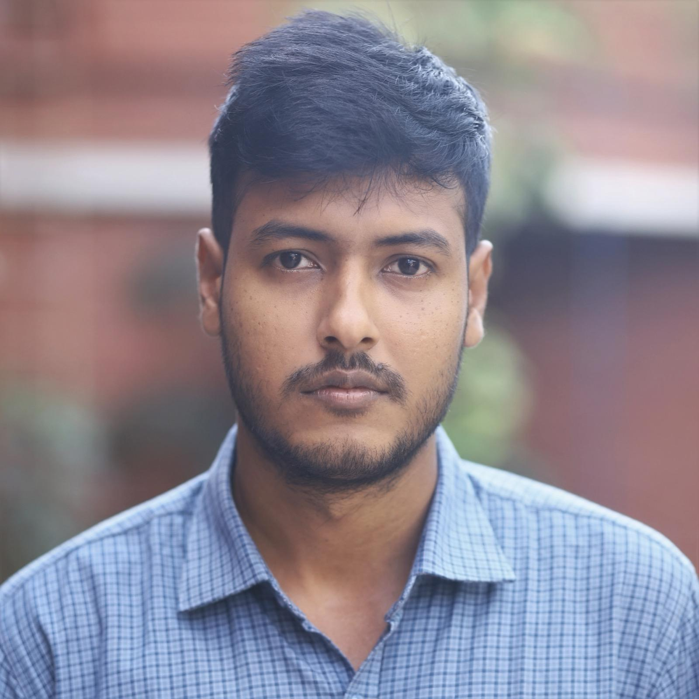

## Md. Sabbir Al Ahsan
Lecturer  
East Delta University  

## About Me

  Hi! I’m a <b>Lecturer</b>, <b>Researcher</b>, and enthusiastic <b>Python Developer</b> with a strong focus on <b>Machine Learning</b> and <b>Deep Learning</b>. I have a long-standing interest in <b>Computer Vision</b>, which is a core area of my expertise. My work combines rigorous understanding with hands-on application across diverse projects. I consider myself dedicated, punctual, and principled—and I’m always eager to learn and take on new challenges.

<table>
<tr> 
<td><a href="https://github.com/sabbirshanto">GitHub</a></td>
<td><a href="https://www.linkedin.com/in/sabbiralahsan/">LinkedIn</a></td>
<td><a href="https://scholar.google.com/citations?user=s4z8E7kAAAAJ&hl=en&authuser=2">Google Scholar</a></td>
<td><a href="https://www.researchgate.net/profile/Sayeda-Anwar?ev=hdr_xprf">Research Gate</a></td>
</tr>
</table>

## Updates
<code style="color: green"><b>[03-03-25]</b></code> 1 paper accepted at 10th ICTIS 2025 2025  
<code style="color: green"><b>[01-10-24]</b></code> Appointed as the Assistant Coordinator for the B.Sc. Program (CSE)  
<code style="color: green"><b>[01-09-24]</b></code> Appointed as a Local Trainer for Python at EDGE Project by ICT Division, Bangladesh and World Bank  
<code style="color: green"><b>[01-02-23]</b></code> Appointed as the Academic Advisor of East Delta Sports Club 
<code style="color: green"><b>[18-09-22]</b></code> Joined as a Lecturer at East Delta University  

## Professional Experiences

* **Assistant Coordinator, B.Sc. Program (CSE)**  
    East Delta University  
    September 2024 - Present  

* **Faculty Advisor, EDU Sports Club**  
    East Delta University  
    October 2021 - February 2024  

* **Advisor, CUET Chess Club**  
    Chittagong University of Engineering and Technology  
    August 2022 - Present  

* **Co-Convenor, Engineering Day 2024 at EDU**  
    East Delta University  
  
## Learning Resources

Here are some learning resources I found useful -

* **YouTube Playlists**
    - Pytorch Tutorials [[link](https://www.youtube.com/playlist?list=PLqnslRFeH2UrcDBWF5mfPGpqQDSta6VK4)]
    - Deep Learning in Hindi [[link](https://www.youtube.com/playlist?list=PLKnIA16_RmvYuZauWaPlRTC54KxSNLtNn)]
    - Machine Learning for Beginners [[link](https://www.youtube.com/playlist?list=PLeo1K3hjS3uvCeTYTeyfe0-rN5r8zn9rw)]

---

Qoute that inspires

> The best way to predict your future is to create it. - 
*Abraham Lincoln*

---
