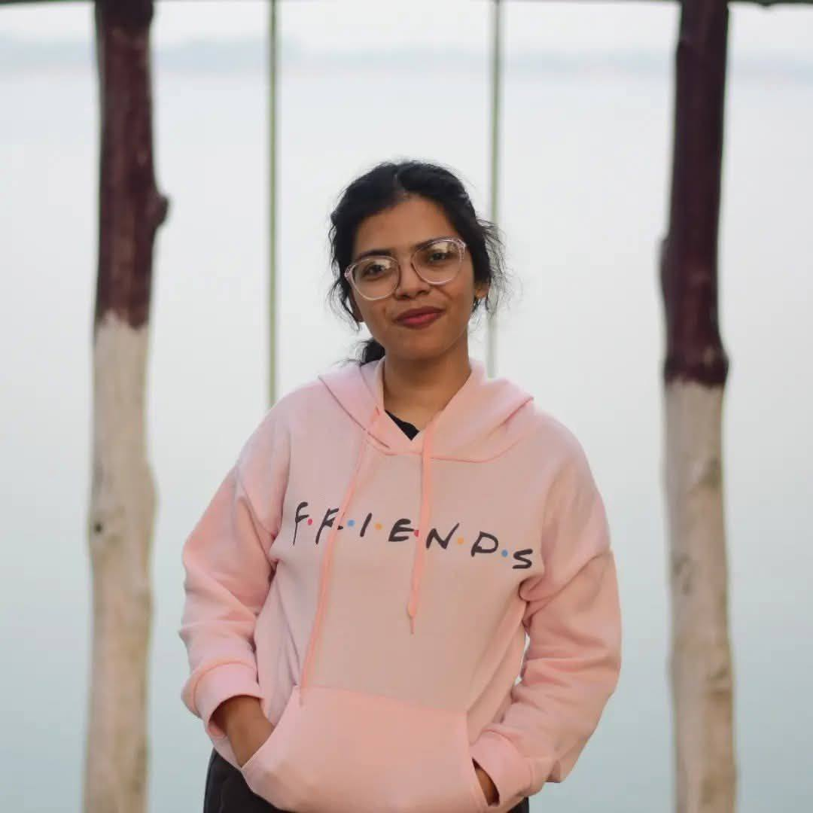

Assistant Professor  
East Delta University  
January 2025 - Present  

Lecturer  
East Delta University  
September 2021 - January 2025  

Local Trainer - Python 
EDGE Project by ICT Division, Bangladesh and World Bank  
September 2024 - January 2025

## About Me

  Hi, I’m an AI enthusiast and researcher with strong skills in <b>Machine Learning</b> and <b>Deep Learning</b>. My research experience spans <b>IoT</b>, <b>Cybersecurity</b>, and <b>Federated Learning</b>, and I’m currently exploring how <b>Generative AI</b> can help build more secure and trustworthy systems.
I’m also fascinated by <b>GenAI</b>, and would love to work with them even beyond cybersecurity-focused applications. Beyond academics, I’m an avid <b>debater</b> who enjoys thoughtful discussions and exchanging ideas that challenge perspectives and inspire innovation.

<table>
<tr> 
<td><a href="https://github.com/suaiba04">GitHub</a></td>
<td><a href="https://www.linkedin.com/in/sayeda-suaiba-anwar-833476154/">LinkedIn</a></td>
<td><a href="https://scholar.google.com/citations?user=29-aD5kAAAAJ&hl=en&oi=ao">Google Scholar</a></td>
<td><a href="https://www.researchgate.net/profile/Sayeda-Anwar?ev=hdr_xprf">Research Gate</a></td>
</tr>
</table>

## Updates
<code style="color: green"><b>[13-05-25]</b></code> <i>BnVITS: A Voice Cloning Approach for Single Speaker Text-to-Speech</i> is now available as preprint - <a href="https://www.researchsquare.com/article/rs-6530449/latest">here</a> and currently under review 
<code style="color: green"><b>[25-04-25]</b></code> Submitted my thesis <i>BnVITS: A Voice Cloning Approach for Single Speaker Text-to-Speech</i> in Journal of Discover Applied Sciences 
<code style="color: green"><b>[28-02-25]</b></code> 3 shared task papers has been accepted at DravidianLangTech-2025 @ NAACL 2025  
<code style="color: green"><b>[08-02-25]</b></code> Promoted to Lecturer  
<code style="color: green"><b>[05-10-24]</b></code> Joined as a Teaching Assistant at East Delta University  
<code style="color: green"><b>[05-08-24]</b></code> 1 shared task paper accepted at GEM 2024  
<code style="color: green"><b>[11-07-24]</b></code> 2 shared task papers accepted at ArabicNLP 2024  
<code style="color: green"><b>[25-06-24]</b></code> 1 shared task paper accepted at CheckThat! 2024  
<code style="color: green"><b>[19-03-24]</b></code> 1 shared task paper accepted at SemEval 2024  
<code style="color: green"><b>[11-10-23]</b></code> 2 shared task papers accepted at BLP Workshop @EMNLP 2023

## Learning Resources

Here are some learning resources I found useful -

* **YouTube Playlists**
    - Pytorch Tutorials [[link](https://www.youtube.com/playlist?list=PLqnslRFeH2UrcDBWF5mfPGpqQDSta6VK4)]
    - Deep Learning in Hindi [[link](https://www.youtube.com/playlist?list=PLKnIA16_RmvYuZauWaPlRTC54KxSNLtNn)]
    - Machine Learning for Beginners [[link](https://www.youtube.com/playlist?list=PLeo1K3hjS3uvCeTYTeyfe0-rN5r8zn9rw)]

## Leadership Experiences

Here are some learning resources I found useful -

* **Coordinator, M.Sc. Program (CSE)**
    East Delta University
    September 2025 - Present

* **Assistant Director, Directorate of Students Activities (DSA)**
    East Delta University
    February 2025 - Present

* **Faculty Advisor, EDU Debating Society**
    East Delta University
    October 2021 - February 2024

* **Vice President (Literature), CUET Debating Society**
    Chittagong University of Engineering and Technology
    August 2019 - August 2020

* **Tournament Collaborator, HULT Prize 2020 at CUET**
    Chittagong University of Engineering and Technology
    August 2019 - December 2019

---

Qoute that inspires

> The best way to predict your future is to create it. - 
*Abraham Lincoln*

---
